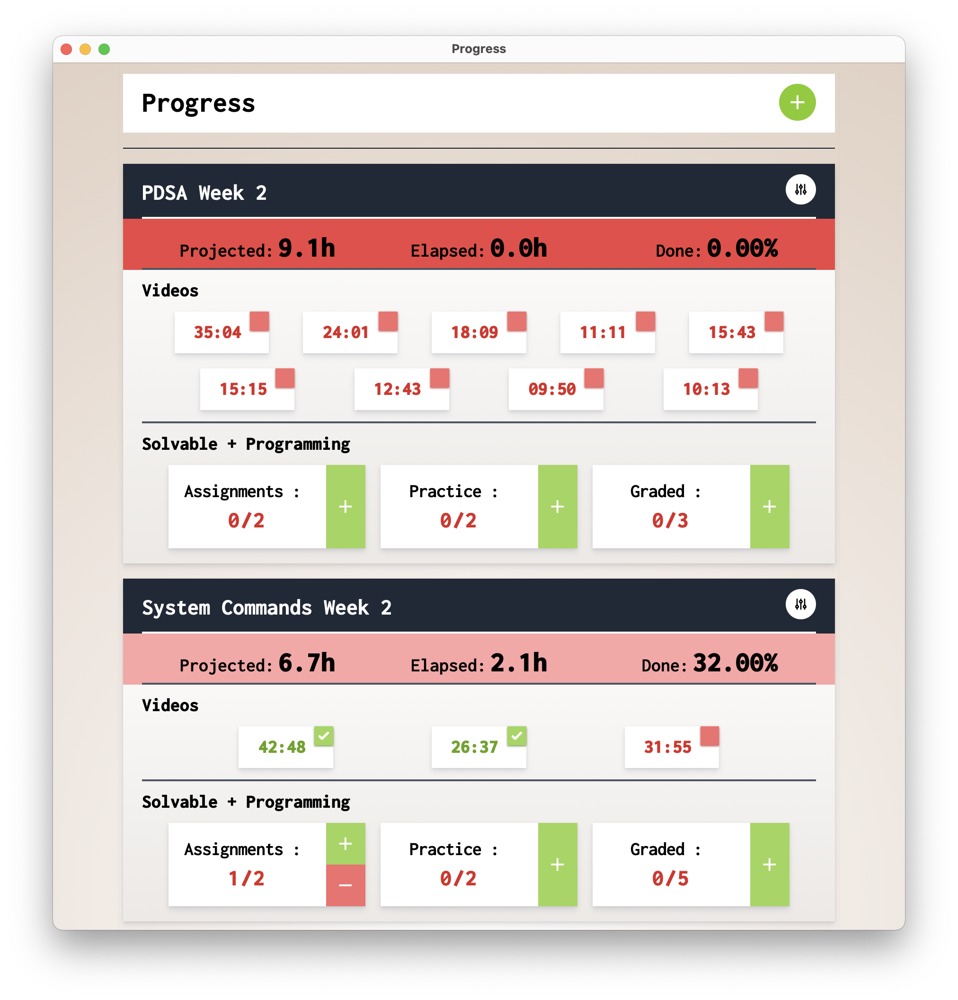

<p align="center">
  
</p>

# Progress

Plan your studies and keep track of your progress

## Dev

Tools used :
- Tauri 🚀⚡️
- Lit
- Tailwinds
- parcel

### Instructions

```
clone the repo
```

Build the assets on your own [Skip this to use uploaded]
```
yarn

cd src
yarn
yarn build or yarn dev
```

Build the app

```
yarn tauri dev or yarn tauri build
```

## Screenshot

<p align="center">
  
</p>


## Info

Currently only providing mac builds [Link](https://github.com/antimatter96/progress/releases/latest)

All deletes are soft deletes. Edit the JSON and mark `deleted : false`

The Json for your progress is saved at `~/.tauri_progres/data.json`
Feel free to sync this, delete this for a new term or just delete all the existing weeks
